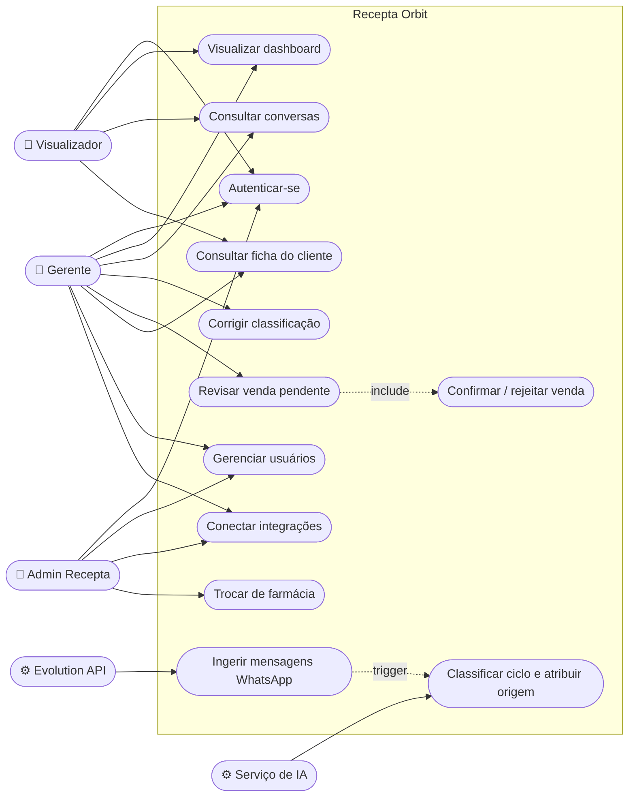
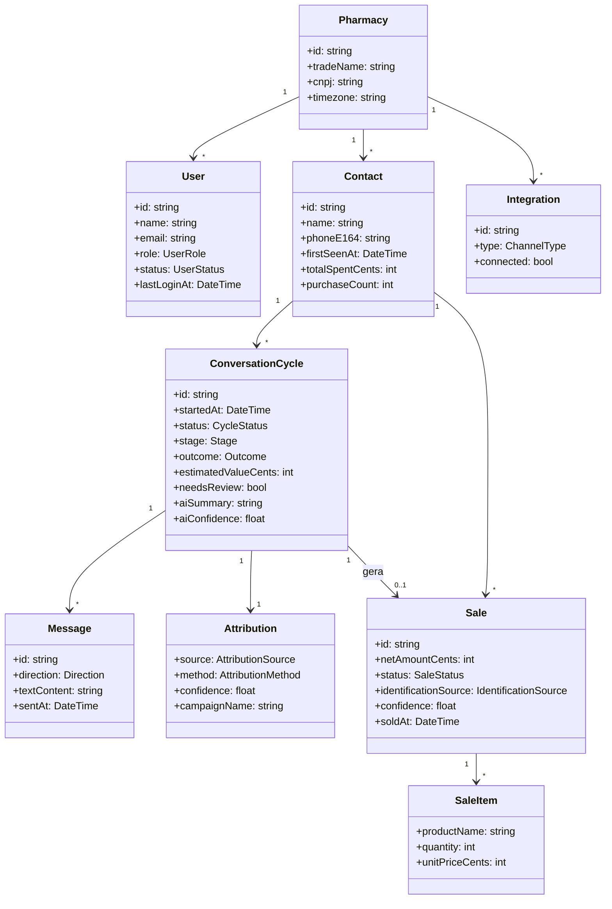
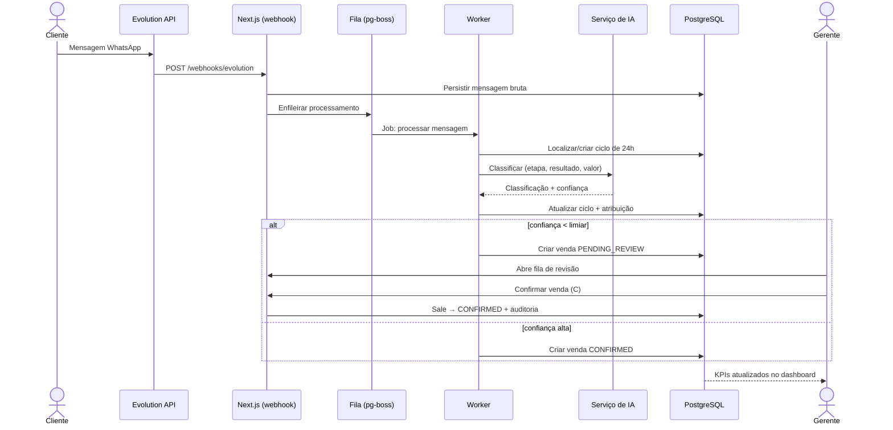
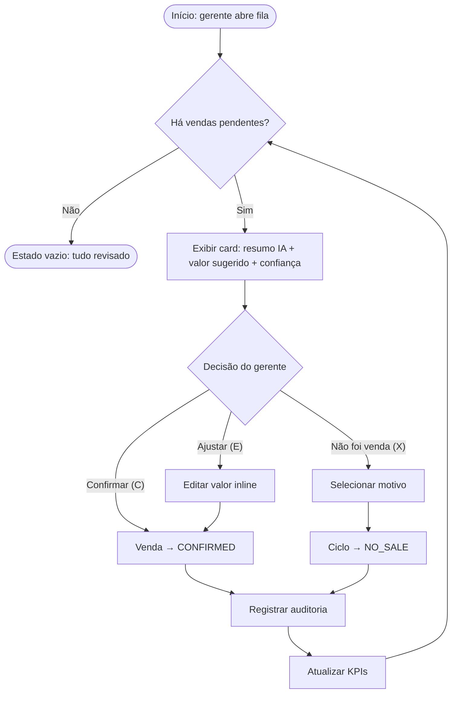
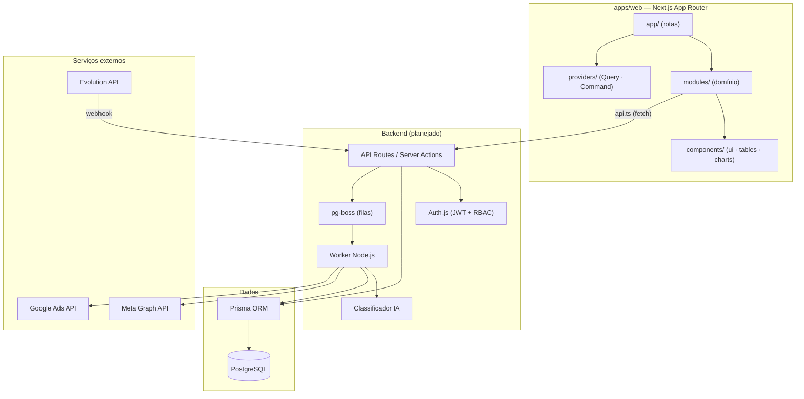
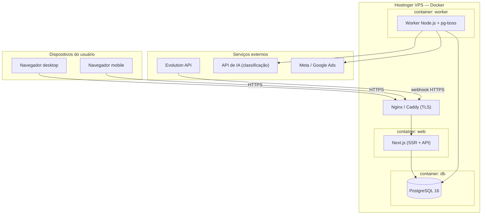

# Recepta Orbit

Sistema de gerenciamento de dados e dashboard de informações em tempo real para farmácias — protótipo frontend (Next.js App Router + TypeScript + Tailwind CSS v4) com dados de exemplo.

> "A receita certa para farmácias."

## Rodando

```bash
npm install
npm run dev
```

Abra **http://localhost:3000** — qualquer usuário/senha entra (login visual, sem backend).

## Telas

| Rota | Descrição |
|------|-----------|
| `/login` | Autenticação (visual) |
| `/app` | Visão Geral — KPIs, conversas/dia, top produtos, vendas por origem |
| `/app/conversas` | Ciclos de conversa 24h com etapa, status, atribuição e confiança da IA |
| `/app/conversas/[id]` | Timeline de mensagens + classificação + evidências de origem |
| `/app/vendas` | Vendas identificadas (IA/manual/integração) com fila de revisão |
| `/app/clientes` | Contatos consolidados por telefone |
| `/app/clientes/[id]` | Ficha com histórico de conversas e compras |
| `/app/configuracoes` | Usuários (RBAC), integrações, dados da farmácia |

## Estrutura

```
src/
├── app/             # rotas (App Router)
├── components/      # sidebar, bottom-tabs, icons (preenchidos), badges
└── lib/mock-data.ts # dados de exemplo — modelo da arquitetura
docs/
├── ARCHITECTURE.md  # resumo da arquitetura (fonte: docx)
├── DESIGN-SYSTEM.md # tokens derivados do manual da marca
└── UX-DESIGN.md     # user flow, sitemap, wireframes, jornada
```

## Design

Manual da marca Recepta aplicado: bege `#FFF5D9` como base (40–50%), laranja `#D4432C` em ação/destaque (20–25%), verde `#6FAF8F` apenas funcional, degradês `#D4432C→#D97055`, Montserrat (corpo) + Poppins (títulos, substituta web da Nexa), ícones preenchidos de cantos arredondados.

Responsivo: sidebar 240px (desktop) → 64px (tablet) → bottom tabs (mobile).

## Arquitetura e Modelagem

Modelagem UML do sistema (Mermaid — renderiza direto no GitHub).

### 1. Diagrama de Casos de Uso



### 2. Diagrama de Classes



### 3. Diagrama de Sequência — mensagem vira venda



### 4. Diagrama de Atividades — revisão de vendas



### 5. Diagrama de Componentes



### 6. Diagrama de Implantação



## Próximas fases

Backend conforme `docs/ARCHITECTURE.md`: Prisma + PostgreSQL, Auth.js, pg-boss, Evolution API (WhatsApp), classificação por IA e atribuição de campanhas.
