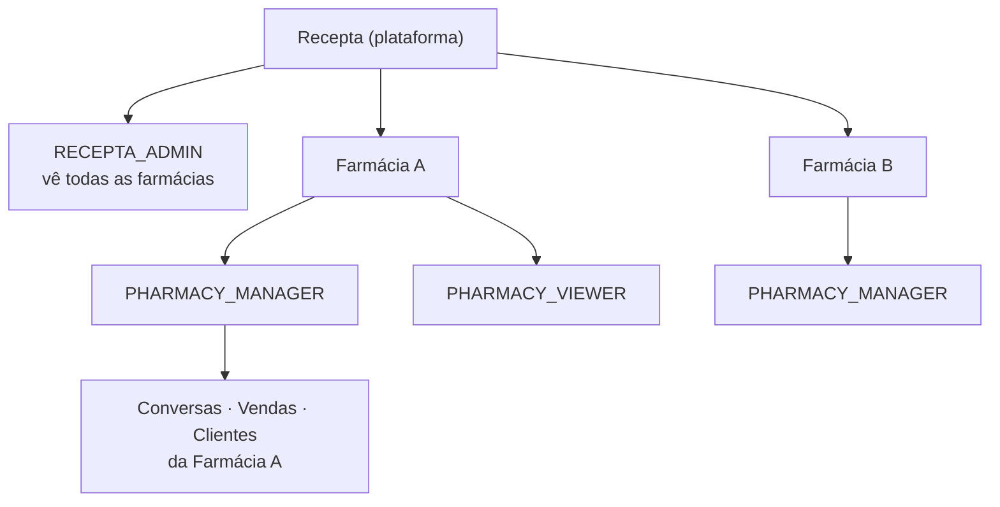
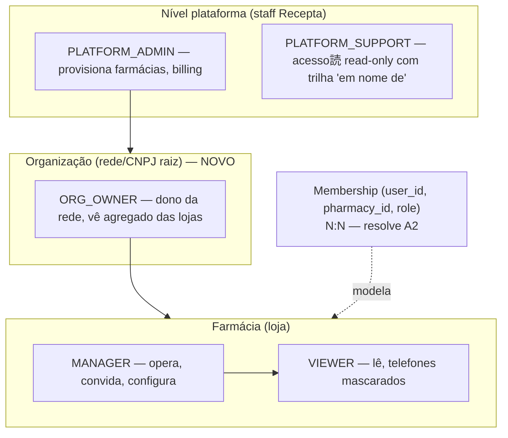
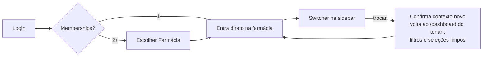
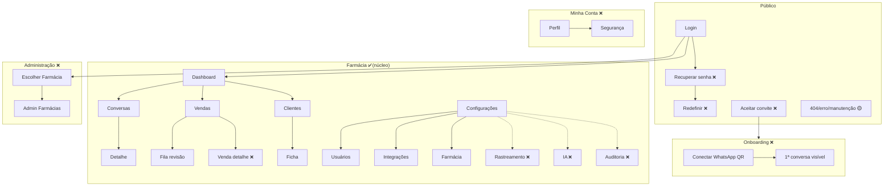

# Recepta Orbit — Auditoria SaaS B2B Multi-tenant

> Head of Product · UX Architect · SaaS Auditor. Complementa `AUDITORIA-PRODUTO.md` (checklist técnica) com foco em **ciclo de vida do usuário, hierarquia multi-tenant e inventário de telas** — o que precisa estar especificado antes do frontend definitivo.
> Base: arquitetura (docx), UML do README, código atual (`modules/`, rotas), UX-DESIGN e UX-LIBRARY.

---

## FASE 1 — Auditoria de Usuários

| # | Item | Status | Motivo |
|---|---|---|---|
| 1 | Perfil do usuário | ❌ Não existe | Nenhuma rota/tela "meu perfil". Sidebar mostra nome/e-mail fixos. O usuário não tem onde ver quem ele é no sistema. |
| 2 | Minha conta | ❌ Não existe | Configurações atuais são 100% da farmácia (usuários/integrações/farmácia). Não há separação conta-pessoal × tenant — lacuna estrutural clássica de SaaS. |
| 3 | Alteração de senha | ❌ Não existe | Sem tela, sem schema. Dependente de "Minha conta" existir. |
| 4 | Recuperação de senha | 🟡 Parcial | Link "Esqueci minha senha" → `#`. Rota `/recuperar-senha` prevista na arquitetura, nunca especificada (fluxo, e-mail, expiração de token). |
| 5 | Primeiro acesso | ❌ Não existe | Convite existe como botão; o que acontece quando o convidado clica no e-mail (define senha? aceita termos? tour?) nunca foi definido. Fluxo inteiro em aberto. |
| 6 | Sessões ativas | ❌ Não existe | Sem definição. Relevante: gerente acessa do balcão (computador compartilhado da farmácia) — revogar sessão é caso real, não luxo. |
| 7 | Histórico de login | 🟡 Parcial | `lastLoginAt` exibido na tabela de usuários. Trilha completa (IP/dispositivo/quando) não modelada. |
| 8 | Último acesso | ✅ Existe | Coluna na tabela de usuários (mock). |
| 9 | Avatar | 🟡 Parcial | Iniciais geradas (`initials()`) em sidebar/clientes. Upload de foto não definido — **decisão**: iniciais bastam para B2B; especificar como padrão e encerrar. |
| 10 | Preferências pessoais | ❌ Não existe | Nada definido (sidebar colapsada já persiste em hook, mas sem tela). Mínimo B2B: nenhuma preferência crítica — documentar como "fora de escopo v1" para não virar lacuna silenciosa. |
| 11 | Troca de farmácia | 🟡 Parcial | TenantSwitcher especificado no UX-DESIGN e FRONTEND-ARCHITECTURE; não construído; comportamento (preserva rota? limpa filtros?) não definido. |
| 12 | Múltiplas farmácias | 🟡 Parcial | Modelo prevê Admin Recepta multi-farmácia. **Ambiguidade não resolvida:** um GERENTE pode pertencer a 2 farmácias (rede com 2 lojas)? O modelo atual (User→1 Pharmacy) diz não; o mercado diz sim. Decisão de produto pendente. |
| 13 | Convites | 🟡 Parcial | Botão + `inviteUserSchema`. Faltam: e-mail enviado, expiração, reenvio, cancelamento, estado "convite pendente" na tabela. |
| 14 | Suspensão de usuário | 🟡 Parcial | Status SUSPENDED existe no tipo e badge. Ação de suspender/reativar (quem pode, o que acontece com a sessão ativa do suspenso) não definida. |
| 15 | Exclusão de conta | ❌ Não existe | B2B: usuário não se auto-exclui — gerente remove. Mas LGPD exige processo definido (anonimizar autoria em auditorias vs apagar). Não especificado. |
| 16 | Exportação de dados | ❌ Não existe | Duas naturezas distintas, nenhuma definida: (a) exportar CSV de vendas/clientes (operacional, pedido óbvio de gerente); (b) exportação LGPD de dados de um contato final que solicitar. |

**Veredito Fase 1:** o produto definiu bem o *trabalho* (conversas→vendas) e não definiu o *trabalhador*. Identidade pessoal do usuário é a maior área não-especificada.

---

## FASE 2 — Hierarquia e Permissões

### Hierarquia atual (como está)



### Relações usuário↔farmácia (modelo atual)

- `User.pharmacy_id` — 1 usuário pertence a exatamente 1 farmácia.
- `RECEPTA_ADMIN` — exceção implícita: "vê todas", sem modelagem de como (campo nulo? flag? tabela de vínculos?). **Não definido.**

### Ambiguidades e conflitos encontrados

| # | Problema | Risco |
|---|---|---|
| A1 | RECEPTA_ADMIN dentro do mesmo enum dos papéis de farmácia | Papel de plataforma misturado com papel de tenant. Query mal escrita devolve admin como "usuário da farmácia" (já acontece: mock lista "Suporte Recepta" na tabela de usuários da drogaria — **vazamento de modelo visível na UI hoje**). |
| A2 | Rede com 2+ lojas | Dono de rede precisaria de 2 logins. Modelo User→1 Pharmacy não atende o segmento que mais paga. |
| A3 | Gerente convida outro gerente? | Matriz papel×ação nunca escrita. Quem suspende quem? Gerente pode rebaixar outro gerente? |
| A4 | Admin Recepta operando farmácia | Ações dele aparecem como de quem? Auditoria precisa registrar "Suporte Recepta agiu em nome de" — não definido (risco de confiança + LGPD). |
| A5 | Viewer vê telefone completo? | LGPD: doc diz mascarar para Viewer, mas a regra papel×campo não está em nenhuma especificação formal. |

### Hierarquia ideal proposta



Mudanças-chave: (1) separar papéis de **plataforma** dos de **tenant** em enums distintos; (2) tabela **Membership N:N** no lugar de `pharmacy_id` no User — uma migração barata agora, caríssima depois; (3) ação de staff sempre gravada com `impersonating_pharmacy_id` na auditoria.

### Fluxo de troca de contexto (proposto)



Regra explícita: troca de tenant **sempre** aterrissa no dashboard (nunca preserva rota — evita ver "conversa 123" da farmácia errada por URL retida).

---

## FASE 3 — Mapeamento de Telas

### Inventário completo

| Tela | Grupo | Status | Objetivo | Usuário | Dados | Ações |
|---|---|---|---|---|---|---|
| Login | Pública | ✅ | Autenticar | Todos | — | Entrar, recuperar senha |
| Recuperar senha | Pública | ❌ | Redefinir credencial | Todos | e-mail | Solicitar link |
| Redefinir senha (token) | Pública | ❌ | Nova senha via link | Todos | token | Definir senha |
| Aceitar convite | Pública | ❌ | Primeiro acesso do convidado | Novo usuário | convite, farmácia | Definir senha, aceitar |
| 404 / erro / manutenção | Pública | 🟡 | Falha digna | Todos | — | Voltar |
| Onboarding pós-1º login | Onboarding | ❌ | Orientar até o "aha" (1ª conversa visível) | Gerente | status da integração | Conectar WhatsApp |
| Escolher Farmácia | Admin/Multi | ❌ | Selecionar tenant | Admin/Org | farmácias + pendências | Entrar, buscar |
| Dashboard | Farmácia | ✅ | Radar do dia | Todos | KPIs, gráficos | Drill-down |
| Conversas (lista) | Farmácia | ✅ | Encontrar ciclo | Todos | tabela de ciclos | Filtrar, abrir |
| Conversa (detalhe) | Farmácia | ✅ | Validar leitura da IA | Gerente | timeline, classificação | **Corrigir (sem modal ❌)** |
| Vendas (lista) | Farmácia | ✅ | Conferir números | Todos | vendas + KPIs | Confirmar, ver conversa |
| Fila de revisão | Farmácia | ✅ | Zerar pendências | Gerente | card por venda | C/E/X (E sem ação 🟡) |
| Venda (detalhe) | Farmácia | ❌ | Itens + auditoria de uma venda | Gerente | itens, trilha | Estornar?, corrigir |
| Clientes (lista) | Farmácia | ✅ | Localizar contato | Todos | tabela | Buscar (decorativa 🟡) |
| Cliente (ficha) | Farmácia | ✅ | Contexto do contato | Todos | KPIs, históricos | Abrir conversa |
| Config › Usuários | Farmácia | ✅ | Gerir equipe | Gerente | tabela | Convidar (sem modal 🟡), suspender ❌ |
| Config › Integrações | Farmácia | ✅ | Estado dos canais | Gerente | 3 cards | Conectar/desconectar (sem confirm ❌) |
| Config › Conectar WhatsApp (QR) | Farmácia | ❌ | Parear Evolution API | Gerente | QR code, status | Escanear, re-parear |
| Config › Farmácia | Farmácia | ✅ | Cadastro | Gerente | form | Salvar |
| Config › Rastreamento | Farmácia | ❌ | Tokens/UTM por campanha | Gerente | links rastreáveis | Gerar link |
| Config › IA | Farmácia | ❌ | Limiar de confiança, revisão automática | Gerente | thresholds | Ajustar |
| Minha conta | Conta | ❌ | Identidade pessoal | Todos | nome, e-mail, senha | Alterar senha |
| Auditoria (log) | Farmácia | ❌ | Quem mudou o quê | Gerente | trilha filtrável | Filtrar |
| Admin › Farmácias | Administração | ❌ | Provisionar tenants | Staff Recepta | lista, status integração | Criar, suspender |

### Telas faltantes (resumo)

**Bloqueiam fluxo existente:** Aceitar convite · Recuperar/Redefinir senha · Conectar WhatsApp (QR) — sem ela a integração core não nasce · modal Corrigir classificação.
**Bloqueiam multi-tenant:** Escolher Farmácia · Admin›Farmácias.
**Mal definidas:** Venda-detalhe (lista tem confirmar inline mas não há onde ver itens+trilha) · Config›IA e Config›Rastreamento (mencionadas na arquitetura — atribuição via token/UTM e limiar de confiança — sem tela correspondente).
**Fluxos incompletos:** convite (e-mail→aceite→primeiro acesso), correção (modal→auditoria→reflexo no dashboard), desconexão WhatsApp (confirmar→estado "desconectado" com aviso persistente no app inteiro).

---

## FASE 4 — Experiência por Módulo

| Módulo | Empty | Error | Loading | Skeleton | Confirm destrutiva | Toast | Feedback geral |
|---|---|---|---|---|---|---|---|
| Dashboard | ❌ onboarding | ❌ | ❌ | ❌ | ➖ | ➖ | KPI pendência → fila ✅ |
| Conversas | 🟡 só DataTable | 🟡 notFound cru | ✅ lista / ❌ detalhe | ✅ | ➖ | ➖ | linha needsReview destacada ✅ |
| Clientes | 🟡 | 🟡 | ✅ lista / ❌ ficha | ✅ | ➖ | ➖ | busca decorativa ❌ |
| Vendas | ✅ fila ("Tudo revisado") | ❌ | ✅ | ✅ | ❌ estorno futuro | ✅ | pending state nos botões ❌ |
| Configurações | ❌ "convide equipe" | 🟡 Zod ✅ / API ❌ | ❌ | ❌ | ❌ **desconectar WhatsApp** | ✅ | — |
| Administração | ❌ tela não existe | ❌ | ❌ | ❌ | ❌ suspender farmácia | ❌ | — |

Lacuna transversal: nenhum **aviso persistente de integração caída** (banner global "WhatsApp desconectado — dados parados desde 14h") — o estado de erro mais importante do produto não tem componente.

---

## FASE 5 — Configurações: mapa ideal

```
Minha Conta (pessoal — NOVO)
├─ Perfil          nome, e-mail (read), iniciais          ❌
├─ Segurança       alterar senha · 2FA (v2)               ❌
├─ Sessões         dispositivos ativos + revogar (v2)     ❌
└─ Preferências    fora de escopo v1 — documentado        ➖

Farmácia (tenant — atual /configuracoes)
├─ Dados da farmácia   form RHF+Zod                       ✅
├─ Usuários            tabela ✅ · convite 🟡 · suspender ❌ · papéis ✅
├─ Permissões          matriz papel×ação visível          ❌ (hoje implícita)
├─ Integrações         cards ✅ · confirmação ❌
│  └─ WhatsApp         pareamento QR · status · re-parear ❌
├─ Rastreamento        gerar links com token p/ campanhas ❌ (núcleo da atribuição!)
└─ IA                  limiar de confiança p/ auto-confirmar · idioma do resumo ❌
```

Maior achado: **Rastreamento e IA são mecânicas centrais da arquitetura** (atribuição por token, venda auto-confirmada por limiar) **sem nenhuma superfície de configuração** — hoje seriam valores mágicos no banco.

---

## FASE 6 — Auditoria UX classificada

| Funcionalidade | Clareza | Descoberta | Navegação | Escala | Mobile | A11y | Classificação |
|---|---|---|---|---|---|---|---|
| Fluxo corrigir classificação | boa (botão claro) | boa | ok | ok | ok | ok | **CRÍTICO** — sem ação por trás |
| Conectar WhatsApp (QR) | — | — | — | — | — | — | **CRÍTICO** — tela inexistente, produto não nasce |
| Convite→primeiro acesso | ruim | ruim | quebra | ok | ? | ? | **CRÍTICO** — fluxo interrompido no e-mail |
| Confirmação destrutiva | — | — | — | — | — | — | **CRÍTICO** |
| Banner integração caída | — | — | — | — | — | — | **CRÍTICO** — silêncio = dados errados sem aviso |
| Filtros/busca reais | boa | boa | ok | **falha >100 itens** | ok | ok | IMPORTANTE |
| Separação Minha Conta × Farmácia | confusa | ruim | mistura | ruim p/ multi | ok | ok | IMPORTANTE |
| Escolher Farmácia + switcher | — | — | — | — | — | — | IMPORTANTE (bloqueia admin) |
| ⌘K descoberta (botão visível) | ok | **ruim** | ok | ok | sem acesso | ok | IMPORTANTE |
| Matriz de permissões na UI | implícita | — | — | risco | — | — | IMPORTANTE |
| Venda-detalhe c/ AuditTrail | — | — | — | — | — | — | IMPORTANTE |
| Config IA / Rastreamento | — | — | — | — | — | — | IMPORTANTE (pode nascer admin-only) |
| Sessões ativas, 2FA | — | — | — | — | — | — | MELHORIA FUTURA |
| PWA, swipe na fila, preferências | — | — | — | — | — | — | MELHORIA FUTURA |
| Export CSV / LGPD | — | — | — | — | — | — | MELHORIA FUTURA (LGPD: definir processo já, tela depois) |

---

## FASE 7 — Roadmap UX

**P1 — antes do frontend definitivo (especificação, não código)**
1. Decidir modelo Membership N:N vs User→1 farmácia (trava o schema inteiro)
2. Separar enums papel-plataforma × papel-tenant; tirar "Suporte Recepta" da lista de usuários do tenant
3. Escrever matriz papel×ação×campo (inclui mascaramento de telefone)
4. Especificar fluxo completo convite→e-mail→aceite→primeiro acesso
5. Especificar fluxo Conectar WhatsApp (QR, estados: pareando/conectado/caído/re-parear)
6. Definir regra de troca de tenant (aterrissa no dashboard, limpa estado)

**P2 — antes do MVP**
7. Modal corrigir classificação + auditoria da correção
8. Confirmação destrutiva reforçada (desconectar WhatsApp)
9. Banner global de integração caída
10. Minha Conta (perfil + alterar senha) separada de Configurações da farmácia
11. Recuperar/redefinir senha · telas públicas de erro/404/manutenção
12. Filtros e buscas funcionais · empty states de onboarding
13. Venda-detalhe com itens + trilha
14. Config › IA e Config › Rastreamento (mesmo que admin-only no início)

**P3 — versões futuras**
15. Sessões ativas, 2FA, histórico de login completo
16. Escolher Farmácia rica (pendências por card) + visão agregada de rede (ORG_OWNER)
17. Export CSV operacional + processo LGPD de exclusão/exportação
18. PWA, swipe na fila, preferências pessoais

---

## ENTREGA FINAL

### 1. Mapa completo do sistema



### 2–5. Hierarquia e fluxos
Ver Fase 2 (hierarquia ideal + troca de contexto). Fluxo do usuário comum: convite→aceite→onboarding→dashboard→loop diário (fila de revisão→conversas→dashboard). Fluxo do administrador: login→Escolher Farmácia→opera como gerente com trilha "em nome de"→troca de tenant pelo switcher. Fluxo multi-farmácia: Membership N:N; troca sempre reinicia no dashboard do tenant.

### 6. Lacunas (top 10)
QR WhatsApp · convite/primeiro acesso · modal de correção · confirmação destrutiva · banner integração caída · Minha Conta · Escolher Farmácia/switcher · Config IA+Rastreamento · venda-detalhe/auditoria · recuperar senha.

### 7. Riscos (top 5)
(1) Retrofit multi-tenant se Membership não for decidido já; (2) staff Recepta misturado a usuários do tenant — vazamento visível hoje; (3) ação destrutiva sem fricção para a integração core; (4) números sem trilha de auditoria minam a proposta central; (5) integração caída silenciosa = decisões sobre dados parados.

### 8. Melhorias
Ver P2/P3 do roadmap.

### 9. Estrutura ideal de navegação

```
/login · /recuperar-senha · /convite/[token]          (público)
/escolher-farmacia                                    (multi-tenant)
/dashboard /conversas[/id] /vendas[/id|/revisao]
/clientes[/id]                                        (tenant)
/configuracoes/{usuarios,integracoes,whatsapp,
                farmacia,rastreamento,ia,auditoria}   (tenant)
/conta/{perfil,seguranca}                             (pessoal)
/admin/farmacias                                      (staff)
```

### 10. Estrutura ideal de menus

```
SIDEBAR                          MENU DO AVATAR (rodapé sidebar)
├ Visão Geral                    ├ Minha conta
├ Conversas  ③                   ├ Trocar farmácia (se 2+)
├ Vendas     ②                   ├ Suporte (WhatsApp Recepta)
├ Clientes                       └ Sair
├ ───────────
├ Configurações                  MOBILE "Mais"
└ [🔍 Buscar  ⌘K]                ├ Clientes · Configurações
                                 ├ Minha conta · Trocar farmácia
[Farmácia atual ▾]  ← switcher   └ Sair
[Avatar · nome]     ← menu
```

Princípio: **trabalho na sidebar, identidade no avatar, tenant no switcher** — três zonas que nunca se misturam.
