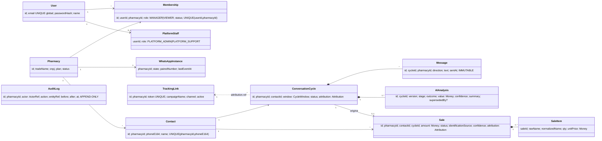
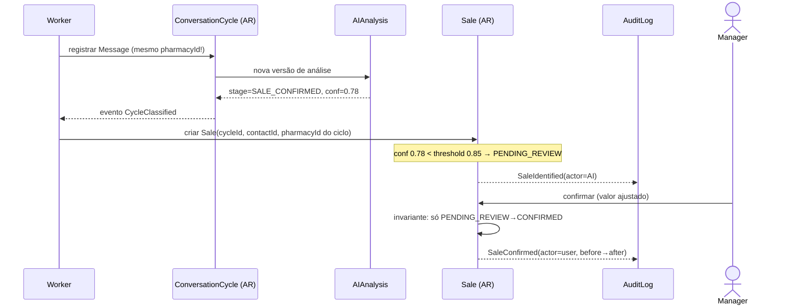

# Recepta Orbit — Validação do Modelo de Domínio

> Staff Software Architect · SaaS multi-tenant. Última validação antes do schema Prisma.
> Fontes: arquitetura (docx), AUDITORIA-SAAS (Membership N:N, enums separados), ESPECIFICACAO-FUNCIONAL (fluxos), ESPECIFICACAO-VISUAL (estados).

---

## 1–3. Bounded Contexts e Aggregate Roots

```
┌─ IDENTITY & ACCESS ─────────────┐  ┌─ TENANCY ──────────────────────┐
│ User (AR)                       │  │ Pharmacy (AR)                  │
│ Membership (AR)                 │  │ WhatsAppInstance (entidade)    │
│ Invite (entidade de Membership) │  │ PharmacySettings/IA (entidade) │
│ Session (entidade de User)      │  └────────────────────────────────┘
└─────────────────────────────────┘
┌─ CONVERSATIONS ─────────────────┐  ┌─ SALES ────────────────────────┐
│ ConversationCycle (AR)          │  │ Sale (AR)                      │
│  ├─ Message (entidade interna)  │  │  └─ SaleItem (entidade interna)│
│  ├─ AIAnalysis (entidade, vers.)│  └────────────────────────────────┘
│  └─ Attribution (VO)            │
└─────────────────────────────────┘
┌─ CONTACTS (CRM) ────────────────┐  ┌─ ATTRIBUTION ──────────────────┐
│ Contact (AR)                    │  │ TrackingLink (AR)              │
│  (projeções: totais, contagens) │  │ Campaign (entidade ou VO ref.) │
└─────────────────────────────────┘  └────────────────────────────────┘
┌─ AUDIT (transversal, append-only) ─────────────────────────────────┐
│ AuditLog (AR imutável)                                             │
└────────────────────────────────────────────────────────────────────┘
```

Comunicação ENTRE contexts: somente por **ID + eventos de domínio**. Sales não navega objeto de Conversations — referencia `conversation_cycle_id` e reage a `CycleClassified`.

> Nota de nomenclatura: o código atual usa `Contact`; specs alternam "Customer/Cliente". **Decisão: `Contact` é o nome canônico do domínio** (nem todo contato é cliente — só vira "cliente" com 1ª compra, que é estado derivado, não entidade). UI continua exibindo "Clientes".

---

## 4. Entidades — responsabilidade, dono, dependências, ciclo de vida

| Entidade | Responsabilidade | Dono dos dados | Dependências | Ciclo de vida |
|---|---|---|---|---|
| **User** | Identidade global de pessoa (credencial, nome) | Plataforma (não pertence a tenant!) | — | criado por convite aceito → ativo → (sem exclusão física; LGPD = anonimizar) |
| **Membership** | Vínculo User×Pharmacy×TenantRole; é ELE que é convidado/suspenso | Tenant | User, Pharmacy | INVITED → ACTIVE → SUSPENDED → REVOKED. Convite expira (7d) sem virar ACTIVE |
| **Pharmacy** | Tenant: cadastro, plano, configurações | Plataforma cria; tenant edita cadastro | — | provisionada (staff) → ativa → suspensa → arquivada |
| **WhatsAppInstance** | Estado do pareamento Evolution (máquina de 4 estados) | Tenant | Pharmacy | DISCONNECTED ⇄ PAIRING → CONNECTED ⇄ DOWN |
| **ConversationCycle** | Janela de 24h de conversa com um contato; unidade de classificação | Tenant | Contact, Attribution(VO) | OPEN → WAITING_* → CLOSED → ARCHIVED. Fecha por 24h de inatividade ou desfecho |
| **Message** | Mensagem individual imutável (espelho do WhatsApp) | Tenant | Cycle (interna) | criada → **imutável para sempre** (fonte de verdade da auditoria) |
| **AIAnalysis** | UMA execução de classificação (etapa, resultado, valor, confiança, resumo, modelo, prompt-version) | Tenant | Cycle (interna) | append-only versionada; a "classificação atual" = última não-superada (humana > IA) |
| **Contact** | Pessoa-cliente consolidada por telefone DENTRO do tenant | Tenant | — | criado na 1ª msg → enriquecido → (LGPD: anonimizável) |
| **Sale** | Fato comercial com status e identificação; nunca booleano no ciclo | Tenant | Contact, Cycle (por id), Attribution(VO copiada no momento) | PENDING_REVIEW → CONFIRMED → REFUNDED · ou → CANCELLED |
| **SaleItem** | Linha de produto (nome bruto + normalizado, qtd, preços) | Tenant | Sale (interna) | vive e morre com a Sale |
| **Attribution** | **VO**: origem+método+confiança+campanha+evidências; snapshot, não entidade | — | TrackingLink (ref opcional) | imutável; re-atribuição = novo VO + auditoria |
| **TrackingLink** | Link rastreável (token→campanha→canal) que origina atribuições | Tenant | Pharmacy | criado → ativo → desativado (nunca deletado: atribuições históricas apontam para ele) |
| **AuditLog** | Trilha imutável: ator (user/IA/sistema), ação, antes→depois, em-nome-de | Tenant (staff lê cross p/ suporte) | refs por id | append-only; NUNCA update/delete |

## 5. Value Objects

| VO | Regra |
|---|---|
| `PhoneE164` | normalizado +55…; igualdade por valor; chave de consolidação do Contact **por tenant** |
| `Money` | `{ amountCents: int ≥ 0, currency: 'BRL' }` — nunca float |
| `Confidence` | decimal 0.00–1.00; obrigatório em toda saída de IA |
| `Attribution` | `{ source, method, confidence, campaignName?, trackingLinkId?, evidence: json }` |
| `CNPJ` | validado por dígito; formatação é da UI |
| `CycleWindow` | `{ startedAt, expiresAt = startedAt+24h }` — regra do ciclo encapsulada |
| `ActorRef` | `{ type: USER|AI|SYSTEM, userId?, onBehalfOf?: pharmacyId }` — autoria na auditoria |

## 6. Eventos de domínio

```
Identity:      UserInvited · InviteAccepted · InviteExpired · MembershipSuspended ·
               MembershipReactivated · PasswordChanged (→ invalida sessões)
Tenancy:       PharmacyProvisioned · WhatsAppPaired · WhatsAppDown · WhatsAppDisconnected
Conversations: MessageReceived · CycleOpened · CycleClosed · CycleClassified(analysis_id) ·
               ClassificationCorrected(actor, before→after)
Sales:         SaleIdentified(confidence) · SaleConfirmed(actor) · SaleRejected(reason) ·
               SaleRefunded
Attribution:   AttributionResolved(method) · TrackingLinkCreated · TrackingLinkDisabled
Settings:      AIThresholdChanged(before→after)
```

Consumidores principais: AuditLog assina TUDO que tem ator; projeções do Contact (totais/contagens) assinam SaleConfirmed/Refunded; badges/contadores assinam SaleIdentified e CycleClassified; GlobalBanner assina WhatsAppDown.

## 7. Relacionamentos (UML de classes)



UML de sequência — invariante central (venda nasce do ciclo):



## 8–9. Regras de consistência e invariantes

**Transacionais (dentro do aggregate):**
1. `ConversationCycle`: no máx. **1 ciclo OPEN por (pharmacyId, contactId)**; mensagem fora da janela abre novo ciclo.
2. `Message`: imutável; sempre herda `pharmacyId` do ciclo (nunca aceita externo).
3. `AIAnalysis`: append-only; correção humana cria versão com `actor=USER` que supera as anteriores — IA nunca sobrescreve correção humana (versão humana só é superada por outra humana).
4. `Sale`: criada apenas a partir de um ciclo com **mesmo pharmacyId e contactId** (FK composta); transições válidas: PENDING→CONFIRMED|CANCELLED; CONFIRMED→REFUNDED; CONFIRMED é imutável em valor (correção = REFUND + nova? **não**: correção de valor permitida ANTES de fechar o dia? — decisão: valor de CONFIRMED só muda via fluxo Corrigir, que grava auditoria).
5. `Money ≥ 0`; `Confidence ∈ [0,1]`; venda CONFIRMED exige `amount > 0`.
6. `Membership`: único por (user, pharmacy); última MANAGER ativa de uma farmácia **não pode** ser suspensa/rebaixada.
7. `AuditLog`: append-only; toda mutação com ator obrigatório; staff sempre com `onBehalfOf`.
8. `TrackingLink`: token único global (vai em URL pública); desativar ≠ deletar.

**Eventuais (projeções):**
9. `Contact.totalSpent/purchaseCount/conversationCount` = projeções de eventos — nunca escritas diretamente; recomputáveis.
10. Badges (pendências) e KPIs = consultas/projeções, jamais contadores armazenados à mão.

**Multi-tenant (globais):**
11. **Toda tabela de domínio tem `pharmacy_id` NOT NULL** (exceto User, PlatformStaff). Unicidade de telefone é `(pharmacy_id, phone)` — o mesmo cliente final pode existir em 2 farmácias como contatos distintos (correto: o dado pertence ao tenant).
12. FKs compostas `(id, pharmacy_id)` nas referências cruzadas (Sale→Cycle, Sale→Contact, Cycle→Contact) — o banco impede mistura de tenants, não só a aplicação.

---

## Anti-patterns identificados (no material de origem)

| # | Anti-pattern | Onde | Correção |
|---|---|---|---|
| 1 | **Classificação como campos do ciclo** (`stage/outcome/aiConfidence/aiSummary` inline no mock) | mock-data/UML inicial | Vira `AIAnalysis` versionada; ciclo expõe "análise vigente" como projeção. Sem isso, correção humana apaga histórico da IA — mata a auditoria e o ajuste fino do modelo. |
| 2 | **Contadores armazenados no Contact** (`purchaseCount`, `totalSpentCents` como colunas-verdade) | mock | São projeções de eventos (regra 9). |
| 3 | **God aggregate Pharmacy** (tentação de pendurar tudo) | UML README | Pharmacy NÃO contém ciclos/vendas — só configura. Contexts separados. |
| 4 | **Papel de plataforma no enum do tenant** | mock `users` ("Suporte Recepta" listado na farmácia) | `PlatformStaff` separado (já decidido na auditoria; modelado acima). |
| 5 | **Attribution como entidade compartilhada** | risco de normalizar demais | É VO-snapshot: a venda guarda a atribuição **do momento**; re-atribuição não reescreve histórico. |
| 6 | **`conversationCycleId: "c-000"` sentinela** | mock sales | Venda sem ciclo (manual/integração) = campo NULLABLE, nunca id mágico. |
| 7 | **User pertencendo à farmácia** (`User.pharmacy_id`) | arquitetura original | Membership N:N (já decidido) — modelado acima. |

## Riscos de schema

1. **Volume de Message** — maior tabela por ordens de magnitude. Índice `(pharmacy_id, cycle_id, sent_at)`; planejar particionamento por tempo desde já (nome de constraint estável); payload bruto do webhook em tabela separada `webhook_events` (replay/debug) e NÃO na Message.
2. **Lookup do ciclo aberto** — caminho quente do worker: índice parcial `(pharmacy_id, contact_id) WHERE status='OPEN'`.
3. **LGPD** — anonimização de Contact precisa preservar integridade de Sales/AuditLog (FK para id que vira "anonimizado", nunca DELETE CASCADE).
4. **`timestamptz` sempre**; fuso é apresentação (Pharmacy.timezone).
5. **AuditLog before/after como jsonb** — flexível, mas exige `action` tipado para consultas; índice `(pharmacy_id, entity_ref, at)`.
6. **Token do TrackingLink** — curto p/ URL e não-sequencial (não enumerable).

## Problemas de escalabilidade

- Webhook Evolution é rajada: ingestão deve ser **gravar bruto + enfileirar** (já desenhado com pg-boss ✓); classificação IA assíncrona nunca no request.
- KPIs do dashboard sobre tabelas quentes: aceitável no MVP com índices; rota de saída definida (views materializadas por farmácia/dia) sem mudar contrato da UI.
- Multi-tenant em banco único com RLS é suficiente até centenas de farmácias; sharding não é problema de agora — mas só funciona se a regra 11/12 existir desde a 1ª migration.

## Violações de multi-tenancy encontradas (e corrigidas acima)

- ✗ mock atual: staff listado como usuário do tenant (anti-pattern 4).
- ✗ UML inicial: User com `pharmacy_id` (anti-pattern 7).
- ✗ Nenhuma especificação anterior exigia FK composta cross-entidade — adicionada (regra 12), é o que impede `Sale` da farmácia A apontar para `Cycle` da farmácia B.
- ✗ Unicidade global de telefone implicaria contato compartilhado entre tenants — corrigida para `(pharmacy_id, phone)` (regra 11).

---

## Veredito

> **"Posso criar o schema Prisma sem risco relevante?"**

**SIM — condicionado a 6 correções entrarem na primeira migration** (todas já resolvidas neste documento, nenhuma pendente de decisão):

1. `Membership` N:N + `PlatformStaff` separado (mata anti-patterns 4 e 7).
2. `AIAnalysis` como entidade versionada append-only (mata anti-pattern 1).
3. FKs compostas `(id, pharmacy_id)` em Sale→Cycle/Contact e Cycle→Contact (regra 12).
4. `Attribution` como snapshot embutido (jsonb/colunas), não tabela compartilhada; `cycleId` da venda nullable (mata 5 e 6).
5. Contadores do Contact como projeções (colunas podem existir, mas escritas só por handler de evento — documentado no schema).
6. `Message` e `AuditLog` imutáveis por convenção + sem rota de update; `webhook_events` separada.

Nenhum alerta grave em aberto. **Época 1 (frontend navegável com mocks) está liberada** — e os mocks atuais devem ser ajustados para refletir o modelo validado (AIAnalysis versionada, venda manual sem ciclo, staff fora da lista do tenant) para que a UI nasça compatível com o schema que virá.
