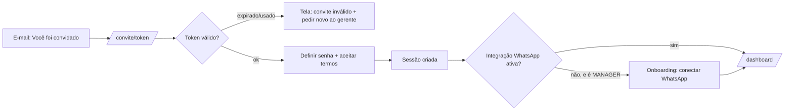
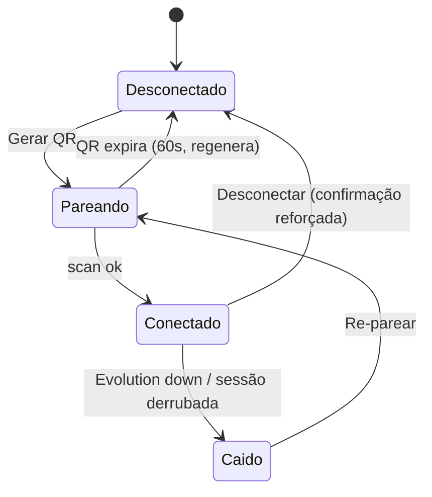
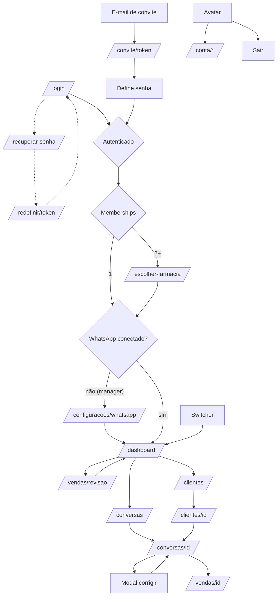

# Recepta Orbit — Especificação Funcional do Frontend

> Documento definitivo de produto. Consolida UX-DESIGN, AUDITORIA-SAAS, AUDITORIA-UX e UX-LIBRARY.
> Decisões assumidas (P1 da auditoria): **Membership N:N** (usuário pode pertencer a 2+ farmácias) · enums separados plataforma×tenant · avatar = iniciais (sem upload) · preferências pessoais fora da v1 · troca de tenant sempre aterrissa no dashboard.

---

## 1. Sitemap definitivo

```
PÚBLICO
/login
/recuperar-senha
/redefinir-senha/[token]
/convite/[token]
/manutencao (estática, servida pelo proxy)
404 · error (globais, com marca)

MULTI-TENANT
/escolher-farmacia                  (2+ memberships ou staff)

TENANT (farmácia ativa em sessão)
/dashboard
/conversas                /conversas/[id]
/vendas                   /vendas/[id]        /vendas/revisao
/clientes                 /clientes/[id]
/configuracoes/usuarios
/configuracoes/integracoes
/configuracoes/whatsapp             (pareamento QR)
/configuracoes/farmacia
/configuracoes/rastreamento
/configuracoes/ia
/configuracoes/auditoria

PESSOAL
/conta/perfil
/conta/seguranca

PLATAFORMA (staff Recepta)
/admin/farmacias
```

## 2. Estrutura de menus — 3 zonas

**Trabalho → sidebar. Identidade → menu do avatar. Tenant → switcher.** Nunca se misturam.

## 3. Sidebar

```
┌──────────────────────────┐
│ ◉ Recepta Orbit          │ ← logo, link p/ /dashboard
│ 🔍 Buscar          ⌘K    │ ← abre Command Palette (descoberta)
│──────────────────────────│
│ ▸ Visão Geral            │
│ ▸ Conversas         ③    │ ← badge = ciclos needsReview (dado real)
│ ▸ Vendas            ②    │ ← badge = vendas PENDING_REVIEW
│ ▸ Clientes               │
│──────────────────────────│
│ ▸ Configurações          │
│──────────────────────────│
│ [⚠ WhatsApp desconectado]│ ← banner condicional, persistente
│ [Drogaria São Paulo  ▾]  │ ← tenant switcher (se 2+ memberships)
│ [AF Antonio Ferreira ▾]  │ ← menu do avatar
└──────────────────────────┘
```

Comportamento: 240px (≥1280) → 64px ícones+tooltip (768–1280) → oculta (<768, vira bottom tabs). Item ativo: fundo accent + indicador degradê. Badges somem quando zero.

## 4. Menu do avatar

```
AF Antonio Ferreira
antonio@dspaulo.com.br
─────────────────────
👤 Minha conta            → /conta/perfil
🔒 Segurança              → /conta/seguranca
🔁 Trocar farmácia        → /escolher-farmacia   (só 2+ memberships)
💬 Suporte Recepta        → wa.me/<numero> (externo)
─────────────────────
↪ Sair                    → encerra sessão → /login
```

Dropdown no desktop; itens dentro do sheet "Mais" no mobile.

## 5. Seletor de farmácia (tenant switcher)

- Visível apenas com 2+ memberships (ou staff). 1 membership = nome estático, sem dropdown.
- Dropdown: lista farmácias com pendências ao lado (`Farma Vida · 4 ⚠`), busca a partir de 6 itens, "Ver todas" → /escolher-farmacia.
- **Regra de troca:** confirma → limpa filtros/seleções → aterrissa em /dashboard do novo tenant → toast "Você está em Farma Vida". URL retida de outro tenant nunca é preservada.
- Staff Recepta: badge "suporte" permanente ao lado do nome do tenant enquanto operam "em nome de".

---

## 6–11. Fluxos

### 6. Primeiro acesso (via convite)



Tela `/convite/[token]`: nome da farmácia + quem convidou ("Camila convidou você para Drogaria São Paulo como Gerente") — contexto antes do formulário. Senha com regra visível (mín. 8). Termos/Privacidade linkados no submit.

### 7. Convite (lado do gerente)

Configurações›Usuários → "Convidar usuário" → **Dialog**: nome, e-mail, papel (Gerente/Visualizador — nunca papéis de plataforma). Submit → toast "Convite enviado para x@y" → linha na tabela com status **Convite pendente** + ações *Reenviar* / *Cancelar*. Expira em 7 dias (mostrado na linha). E-mail reenviado invalida token anterior.

Permissões: MANAGER convida ambos os papéis; VIEWER não vê o botão. Suspensão: dropdown por linha (Suspender/Reativar) com confirmação simples; suspenso perde sessão ativa imediatamente.

### 8. Conexão WhatsApp (`/configuracoes/whatsapp`)



- Tela mostra estado grande e inequívoco + instrução por estado. Pareando: QR + contador de expiração + "abra o WhatsApp > aparelhos conectados".
- **Caído** dispara o **banner global** em todas as telas: "⚠ WhatsApp desconectado desde 14h32 — conversas não estão sendo coletadas. [Reconectar]". Banner só some com estado Conectado.
- Desconectar: ConfirmationDialog reforçado (digitar nome da farmácia) — consequência explícita: "interrompe a coleta de TODAS as conversas".

### 9. Troca de farmácia
Ver §5. Entrada: switcher ou /escolher-farmacia. Saída: sempre /dashboard do destino, estado limpo.

### 10. Minha Conta

- `/conta/perfil`: nome (editável), e-mail (read-only — alterado via suporte), iniciais do avatar (preview), farmácias a que pertence com papel em cada (read-only).
- `/conta/seguranca`: alterar senha (atual + nova + confirmação, Zod min 8) → invalida outras sessões → toast + e-mail de notificação. Placeholder visível "2FA — em breve" (v2) para sinalizar roadmap sem prometer data.

### 11. Configurações (tenant)

Tabs: Usuários · Integrações · WhatsApp · Farmácia · Rastreamento · IA · Auditoria.
- **Rastreamento**: lista de links rastreáveis por campanha (nome, canal, token, cliques→conversas atribuídas); ação "Gerar link" → Dialog (nome + canal) → URL `wa.me` com token, botão copiar. Empty: "Crie seu primeiro link rastreável para atribuir conversas a campanhas".
- **IA**: limiar de confiança para auto-confirmar venda (slider 50–95%, default 85%) + preview do efeito ("com 85%, 2 das últimas 10 vendas iriam para revisão") + idioma do resumo. Alterações auditadas.
- **Auditoria**: AuditTimeline filtrável (autor, tipo de ação, período). Read-only.

---

## Especificação por tela

Formato: **Objetivo · Componentes · Permissões · Vazio · Erro · Loading · Mobile · Desktop**. Telas já auditadas em AUDITORIA-UX (Dashboard, Conversas±detalhe, Vendas±fila, Clientes±ficha, Config Usuários/Integrações/Farmácia) valem como especificadas — abaixo, as novas/alteradas.

### /login
Objetivo: autenticar. · Componentes: split hero + form (usuário, senha, lembrar), erro inline. · Permissões: público. · Vazio: ➖. · Erro: credencial inválida (mensagem única, sem revelar qual campo), conta suspensa, rate-limit ("tente em 5 min"). · Loading: pending no botão. · Mobile: hero oculto, form full. · Desktop: split 50/50.

### /recuperar-senha + /redefinir-senha/[token]
Objetivo: retomar acesso sem suporte. · Componentes: form e-mail → confirmação neutra ("se existir conta, enviamos link" — não vaza existência); redefinir: nova senha ×2. · Permissões: público. · Erro: token expirado → CTA pedir novo. · Loading: pending. · Mobile/Desktop: card central.

### /convite/[token]
Ver fluxo §6. · Permissões: público com token. · Erro: inválido/expirado/já usado (telas distintas, CTA claro). · Vazio: ➖.

### /escolher-farmacia
Objetivo: selecionar tenant; triagem do que precisa de atenção. · Componentes: grid de cards (nome, pendências, status WhatsApp com ⚠ se caído), busca. · Permissões: 2+ memberships ou staff. · Vazio: staff sem farmácias → CTA /admin/farmacias; usuário comum nunca vê vazio (1 membership pula a tela). · Erro: retry. · Loading: skeleton de grid. · Mobile: 1 coluna. · Desktop: grid 3.

### /vendas/[id]
Objetivo: anatomia de uma venda — itens, origem, trilha. · Componentes: header (cliente, status, valor), tabela de itens, EvidencePanel de atribuição, AuditTimeline, link para conversa. · Permissões: todos veem; MANAGER corrige/estorna (confirmação simples). · Vazio: trilha vazia → "nenhuma alteração manual". · Erro: notFound com marca. · Loading: skeleton. · Mobile: empilhado. · Desktop: 2 colunas (itens | trilha).

### /configuracoes/whatsapp
Ver fluxo §8. · Permissões: MANAGER. VIEWER vê estado, sem ações. · Loading: skeleton do painel de estado. · Mobile: QR centralizado full-width.

### /configuracoes/rastreamento
Ver §11. · Permissões: MANAGER cria; VIEWER lê. · Erro: falha ao gerar → toast erro. · Loading: skeleton tabela. · Mobile: cards por link com botão copiar grande.

### /configuracoes/ia
Ver §11. · Permissões: MANAGER. · Vazio: ➖ (sempre tem default). · Mobile: slider full-width com valor grande.

### /configuracoes/auditoria
Ver §11. · Permissões: MANAGER. · Vazio: "Nenhuma ação registrada ainda". · Mobile: timeline 1 col.

### /conta/perfil · /conta/seguranca
Ver §10. · Permissões: o próprio usuário. · Loading: skeleton do form. · Mobile: 1 col.

### /admin/farmacias
Objetivo: staff provisiona e monitora tenants. · Componentes: DataTable (nome, plano, status WhatsApp, pendências, último evento), criar farmácia (Dialog), suspender (confirmação reforçada). · Permissões: PLATFORM_ADMIN; PLATFORM_SUPPORT read-only. · Vazio: CTA criar primeira. · Mobile: cards.

### Modal "Corrigir classificação" (sobre /conversas/[id])
Objetivo: humano sobrepõe a IA com trilha. · Componentes: Dialog com etapa (select), resultado (select), valor (MoneyInput), motivo (textarea, obrigatório — `correctionSchema` já definido), aviso "isso registra auditoria". · Permissões: MANAGER. · Erro: validação inline. · Loading: pending no salvar → toast + painel atualizado + entrada na AuditTimeline.

---

## A) User Flow completo



## B) Information Architecture

```
Nível 0  Acesso        login · recuperar · convite
Nível 1  Contexto      escolher-farmacia (condicional)
Nível 2  Hub           dashboard (radar; todo número faz drill-down)
Nível 3  Listas        conversas · vendas · clientes · configurações(7 tabs) · admin
Nível 4  Detalhe       conversa · venda · cliente · auditoria
Nível 5  Ação          fila de revisão · modais (corrigir, convidar, confirmar)
Paralelo Pessoal       conta/perfil · conta/seguranca
```

Profundidade máx. 4 cliques do dashboard a qualquer ação. Cross-links como grafo: conversa↔venda↔cliente↔campanha.

## C) Wireframes textuais (novas telas)

```
/escolher-farmacia                    /configuracoes/whatsapp (pareando)
┌ Suas farmácias        [buscar] ┐    ┌ WhatsApp ──────────────────────┐
│ ┌─────────┐ ┌─────────┐       │    │   Estado: ⏳ Aguardando scan   │
│ │Drog. SP │ │Farma    │       │    │   ┌────────┐  1. Abra WhatsApp │
│ │ 4 ⚠     │ │Vida ✓   │       │    │   │   QR   │  2. Aparelhos    │
│ │WA ✓     │ │WA caído⚠│       │    │   │  47s   │     conectados   │
│ └─────────┘ └─────────┘       │    │   └────────┘  3. Escaneie     │
└────────────────────────────────┘    │   [Gerar novo QR]             │
                                      └────────────────────────────────┘
/conta/seguranca                      Modal Corrigir classificação
┌ Minha conta › Segurança ──────┐    ┌ Corrigir classificação ─────×─┐
│ Senha atual    [________]     │    │ Etapa     [Venda confirmada▾] │
│ Nova senha     [________]     │    │ Resultado [Venda ▾]           │
│ Confirmar      [________]     │    │ Valor     [R$ 210,00]         │
│ [Alterar senha]               │    │ Motivo*   [____________]      │
│ ── 2FA: em breve ──           │    │ ⓘ Registrado na auditoria     │
└────────────────────────────────┘    │        [Cancelar] [Salvar]   │
                                      └────────────────────────────────┘
Banner global (integração caída)
┌⚠ WhatsApp desconectado desde 14h32 — conversas não coletadas [Reconectar]┐
```

## D) Design System necessário

Tudo de UX-LIBRARY.md, mais os **novos** exigidos por esta spec:
1. **GlobalBanner** (persistente, 1 por vez, variante danger/warning, ação inline)
2. **TenantSwitcher** (dropdown com pendências + busca)
3. **AvatarMenu** (dropdown de identidade)
4. **QrPanel** (QR + countdown + regeneração)
5. **StatusHero** (estado grande da integração: conectado/pareando/caído)
6. **CopyField** (URL rastreável com copiar + feedback)
7. **ThresholdSlider** (limiar IA com preview de impacto)
8. **InviteRow** (linha de usuário com estado pendente + reenviar/cancelar)
Já cobertos: DataTable, Filters, ConfirmationDialog (2 níveis), EmptyState (3 variantes), AuditTimeline, ChatTimeline, ConfidencePill, Form/MoneyInput, CommandPalette, Toast, Modal, Drawer, Skeleton.

## E) Backlog priorizado

**Época 1 — fluxo de identidade (desbloqueia tudo)**
1. Rotas públicas: recuperar/redefinir senha, convite/[token], 404/error com marca
2. Modal de convite + estados pendente/reenviar/cancelar na tabela
3. Minha Conta (perfil + alterar senha) + menu do avatar
4. Matriz papel×ação aplicada na UI (VIEWER sem botões de mutação; telefone mascarado)

**Época 2 — integração core**
5. /configuracoes/whatsapp com máquina de estados + QrPanel
6. GlobalBanner de integração caída
7. ConfirmationDialog reforçado no desconectar
8. Onboarding pós-primeiro-acesso (manager sem WhatsApp → QR)

**Época 3 — confiança no número**
9. Modal Corrigir classificação + correctionSchema + reflexo na UI
10. /vendas/[id] com itens + AuditTimeline
11. /configuracoes/auditoria
12. Badges da sidebar derivados de dados reais

**Época 4 — multi-tenant**
13. /escolher-farmacia + TenantSwitcher + regra de aterrissagem
14. /admin/farmacias (staff)
15. Badge "suporte em nome de"

**Época 5 — alavancas de atribuição**
16. /configuracoes/rastreamento (links com token)
17. /configuracoes/ia (ThresholdSlider)
18. Filtros/busca funcionais em todas as listas (se ainda pendente)
