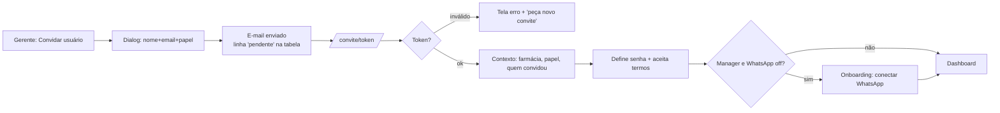
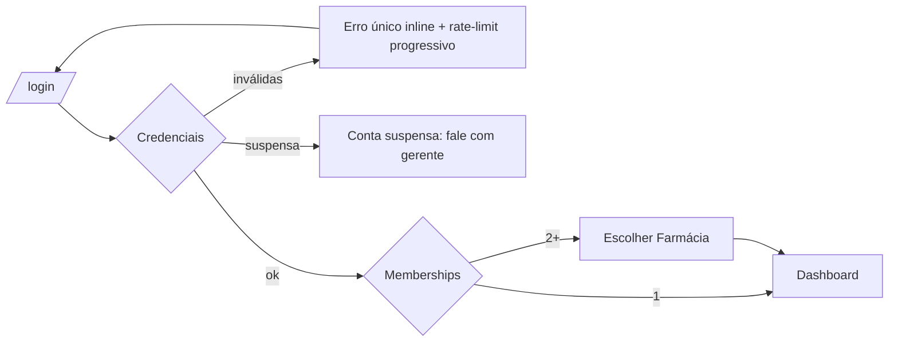
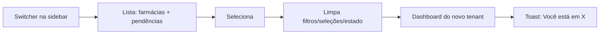
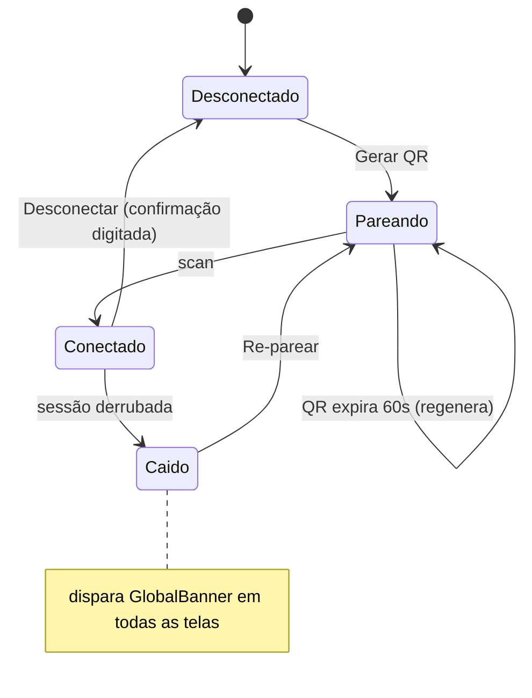
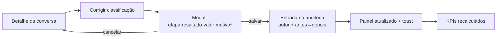
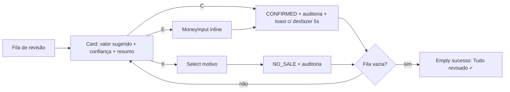
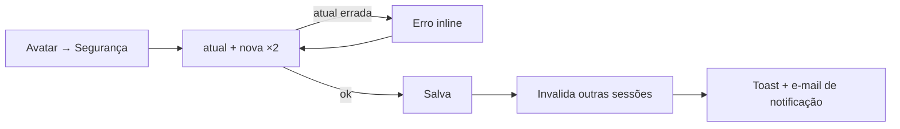

# Recepta Orbit — Especificação Visual Definitiva

> Senior Product Design (referências: Linear, Stripe, Notion, Vercel, Clerk).
> Última camada antes do frontend: valida a IA visualmente. Consolida ESPECIFICACAO-FUNCIONAL + UX-LIBRARY + mockups Hi-Fi já aprovados (Fase D).

---

## FASE 1 — Information Architecture (árvore completa)

```
Recepta Orbit
├─ Acesso (público)
│  ├─ Login
│  │  ├─ Erro: credencial inválida · suspensa · rate-limit
│  │  └─ → Recuperar senha
│  ├─ Recuperar senha → confirmação neutra
│  ├─ Redefinir senha [token] → sucesso → Login
│  ├─ Aceitar convite [token]
│  │  ├─ Contexto (farmácia + quem convidou + papel)
│  │  ├─ Definir senha + termos
│  │  └─ Erro: expirado · usado · inválido
│  └─ 404 · Erro global · Manutenção
│
├─ Primeiro Acesso (pós-convite)
│  ├─ Sessão criada
│  ├─ [MANAGER sem WhatsApp] → Onboarding: Conectar WhatsApp
│  └─ → Dashboard
│
├─ Escolher Farmácia (2+ memberships / staff)
│  ├─ Grid de cards (pendências + status WhatsApp)
│  └─ Busca
│
├─ Dashboard (hub — todo número faz drill-down)
│  ├─ KPI Total vendido → Vendas (filtro: confirmadas)
│  ├─ KPI Ticket médio
│  ├─ KPI Conversão
│  ├─ KPI Pendentes ⚠ → Fila de revisão
│  ├─ Conversas/dia (gráfico) → Conversas
│  ├─ Top produtos
│  ├─ Vendas por origem → Vendas (filtro: origem)
│  └─ Conversas recentes (5) → Detalhe
│
├─ Conversas
│  ├─ Lista (filtros: período·origem·etapa·status·revisão)
│  └─ Detalhe [id]
│     ├─ Timeline de mensagens + resumo IA
│     ├─ Painel: classificação · origem/evidências · venda associada
│     ├─ Modal: Corrigir classificação (→ auditoria)
│     └─ → Ficha do cliente · → Venda
│
├─ Vendas
│  ├─ Lista (KPIs + filtros + confirmar inline)
│  ├─ Detalhe [id] (itens · evidências · AuditTimeline · estornar)
│  └─ Fila de revisão (card único · C/E/X · progresso)
│
├─ Clientes
│  ├─ Lista (busca + ordenação)
│  └─ Ficha [id] (KPIs · conversas · compras · dados)
│
├─ Configurações (tenant — 7 tabs)
│  ├─ Usuários (tabela · convidar · suspender · convites pendentes)
│  ├─ Integrações (cards de canal)
│  ├─ WhatsApp (máquina de estados + QR)
│  ├─ Farmácia (cadastro)
│  ├─ Rastreamento (links com token por campanha)
│  ├─ IA (limiar de confiança + idioma)
│  └─ Auditoria (timeline filtrável)
│
├─ Minha Conta (pessoal)
│  ├─ Perfil (nome · e-mail ro · farmácias/papéis ro)
│  └─ Segurança (alterar senha · 2FA "em breve")
│
└─ Administração (staff Recepta)
   └─ Farmácias (DataTable · criar · suspender · monitorar)
```

---

## FASE 2 — User Flows visuais

### 1. Convite → Primeiro acesso


### 2. Login


### 3. Troca de farmácia


### 4. Conectar WhatsApp


### 5. Corrigir classificação


### 6. Confirmar venda


### 7. Alterar senha


### 8. Administração de usuários
```mermaid
flowchart TD
    U[Config › Usuários] --> INV[Convidar → Dialog → pendente]
    U --> ROW[⋯ menu da linha]
    ROW --> SUS[Suspender → confirmação simples → sessão derrubada]
    ROW --> REA[Reativar]
    ROW --> RES[Reenviar convite (se pendente)]
    ROW --> CAN[Cancelar convite]
    SUS & REA & RES & CAN --> AUD[Auditoria]
```

---

## FASE 3 — Wireframes Low-Fi

Legenda: `[S]`=sidebar 240px · `⚠`=banner condicional · linhas omitem repetição.

### Dashboard
```
┌[S]──────┬────────────────────────────────────────────────┐
│◉ Orbit  │ ⚠ WhatsApp desconectado desde 14h32 [Reconectar]│
│🔍 ⌘K    │ Visão Geral                    [Período 14d ▾] │
│▸Geral   │ ┌Total R$327┐┌Ticket R$81┐┌Conv 57%┐┌⚠ Pend 1→┐│
│▸Conv ③  │ │+12% verde │└───────────┘└────────┘│fundo amb││
│▸Vendas ②│ └───────────┘                       └─────────┘│
│▸Clientes│ ┌Conversas/dia (barras)─┐┌Top produtos────────┐│
│─────────│ └───────────────────────┘└────────────────────┘│
│▸Config  │ ┌Vendas por origem: Meta·Google·IG·WA─────────┐│
│─────────│ ┌Conversas recentes (5)──────────────Ver todas┐│
│[Farm ▾] │ └─────────────────────────────────────────────┘│
│[AF ▾]   │                                                │
└─────────┴────────────────────────────────────────────────┘
```

### Conversas (lista)
```
│ Conversas — 2 precisam de revisão   [Período▾][Origem▾]  │
│                                     [Etapa▾][Só revisão] │
│ chips ativos: Origem: Meta ✕ · Limpar tudo               │
│ ┌Contato│Origem│Etapa│Status│Result│Valor│Hora│IA│Rev──┐ │
│ │Maria S│Meta  │Venda│Encer.│Venda │ 89,00│14:51│91%│  │ │
│ │João P*│Google│Orçam│Aguard│ ?    │122,90│13:22│74%│⚠ │ │ *fundo cream-50
│ └───────────────────────────────── Página 1 de 1 ──────┘ │
```

### Detalhe da Conversa
```
│ ← Conversas                       [Corrigir classificação]│
│ Maria Silva · (11)9****-3421 → ficha                      │
│ ┌Timeline (60%)──────────┐ ┌Classificação (40%)─────────┐ │
│ │◖ cliente 14:42         │ │Etapa [Venda conf.] IA 91%  │ │
│ │       farmácia 14:43 ◗ │ │Status·Resultado·Valor      │ │
│ │◖ cliente 14:45         │ ├Origem & evidências─────────┤ │
│ │✦ Resumo IA: comprou 3cx│ │Meta Ads 97% · método·camp. │ │
│ └────────────────────────┘ ├Venda associada S-1041──────┤ │
│                            └Auditoria (2 alterações)────┘ │
```

### Clientes
```
│ Clientes — 9                    [🔍 nome ou telefone…]    │
│ ┌Nome│Tel│1º│Último│Conv│Compras│Total│Ticket│Origens──┐ │
│ │RL Rafael Lima│…│…│…│12│7│R$521│R$74│[Meta]──────────│ │
│ └──────────────────────────────────────────────────────┘ │
```

### Vendas
```
│ Vendas            [Período▾][Origem▾][Status▾]           │
│ ┌Total┐┌Confirmadas┐┌Ticket┐┌⚠Pendentes 1 → fila┐        │
│ ┌Cliente│Data│Origem│Camp│Produtos│Valor│Status│IA│Ação┐ │
│ │Carlos*│…│Google│Marca│Manipulado│210│Pend 55%│[Confirmar]│
│ │Maria  │…│Meta│Gen.│3×Dipirona│89│Conf ✓ 91%│Ver conversa│
│ └──────────────────────────────────────────────────────┘ │
```

### Minha Conta
```
│ Minha conta                                              │
│ [Perfil] [Segurança]            ← tabs                   │
│ ┌Perfil────────────────────────┐                         │
│ │ (AF)  Nome [Antonio Ferreira]│                         │
│ │ E-mail antonio@… (somente leitura)                     │
│ │ Farmácias: Drogaria SP — Gerente                       │
│ │ [Salvar]                     │                         │
│ └──────────────────────────────┘                         │
```

### Configurações
```
│ Configurações                                            │
│ [Usuários][Integrações][WhatsApp][Farmácia]              │
│ [Rastreamento][IA][Auditoria]        ← tabs roláveis     │
│ ┌Usuários──────────────────[Convidar usuário]┐           │
│ │Nome│Email│Papel│Status│Último acesso│ ⋯    │           │
│ │Ana │…│Gerente│Convite pendente·exp 5d│Reenviar·Cancelar│
│ └─────────────────────────────────────────────┘          │
```

### Administração (staff)
```
│ Farmácias                          [+ Criar farmácia]    │
│ [🔍 buscar…]                                             │
│ ┌Nome│Plano│WhatsApp│Pendências│Último evento│ ⋯ ──────┐ │
│ │Drog. SP│Pro│✓ Conectado│4│msg há 2min│Suspender      │ │
│ │Farma V.│Start│⚠ Caído 3h│0│—│Entrar como suporte     │ │
│ └──────────────────────────────────────────────────────┘ │
```

### Conectar WhatsApp
```
│ Configurações › WhatsApp                                 │
│ ┌──────────── StatusHero ─────────────┐                  │
│ │   ⏳ Aguardando leitura do QR        │                  │
│ │   ┌─────────┐   1. Abra o WhatsApp  │                  │
│ │   │   QR    │   2. Aparelhos conect.│                  │
│ │   │  0:47   │   3. Escanear código  │                  │
│ │   └─────────┘   [Gerar novo QR]     │                  │
│ └─────────────────────────────────────┘                  │
│ Conectado: número, instância, desde · [Desconectar]      │
```

Mobile (todas): sidebar→bottom tabs (Geral·Conversas·Vendas·Mais) · tabelas→cards · painéis laterais→empilham/bottom sheet · filtros→trilho rolável ou Drawer · QR centralizado full-width.

---

## FASE 4 — Design System

### Fundações

| Token | Especificação |
|---|---|
| **Tipografia** | Display: Poppins (Nexa-substituta) 500–700 — títulos, KPIs, brand. Texto: Montserrat 400–600. Escala: 11/12/13/14/15/18/24/28. Dados: `tabular-nums`. Dois pesos visíveis por superfície (400 + 500/600). |
| **Grid** | Container fluido; conteúdo max 1440. Colunas: 12 (gap 16) desktop · 4 mobile. KPIs 4→2→2 · charts 2→1 · listagens full. |
| **Spacing** | Base 4px. Escala: 4·8·12·16·20·24·32·40. Página: 32 desktop · 16 mobile. Card interno: 20. Entre seções: 24. |
| **Elevation** | Sombras tingidas de ink (#0A0D0C α .05–.13), nunca cinza-azul. xs=linha de borda · sm=cards · md=dropdown/popover · lg=modal. Banner e sidebar: flat. |
| **Radius** | 6 controles pequenos · 8 inputs/botões · 12 cards · 16 modais · full pills/badges. Nunca raio em borda single-side. |
| **Ícones** | Preenchidos, cantos arredondados (manual da marca) · 16 nav/inline · 18–20 destaque · traço uniforme · proibido outline fino. |
| **Cor** | Bege #FFF5D9 base 40–50% · branco superfícies de dados · laranja #D4432C só ação/destaque 20–25% (1 ação primária por viewport) · ink #0A0D0C sidebar/texto · verde #6FAF8F apenas indicador · degradê permitido só brand-500→400. Texto auxiliar <14px: mínimo #695C57 (AA). |

### Componentes (contratos visuais)

| Componente | Especificação-chave |
|---|---|
| **Sidebar** | 240→64→oculta. Item: 40px alto, ícone 16 + label 13. Ativo: bg ink-700 + barra degradê 3px à esquerda. Badge: pill laranja, some em zero. Zonas: busca topo · nav · config · rodapé (banner→switcher→avatar). |
| **Topbar (mobile)** | 56px: hambúrguer ausente (bottom tabs), logo central, busca à direita. |
| **Tenant Switcher** | Botão com nome + chevron; dropdown md-elevation: farmácias com contagem ⚠; busca ≥6; rodapé "Ver todas". Só com 2+ memberships. |
| **Avatar Menu** | Círculo 36px degradê brand com iniciais; dropdown: nome/e-mail header, Minha conta, Segurança, Trocar farmácia, Suporte, Sair (separado). |
| **KPI Card** | 20px padding, label 13 cinza, valor 24 display, delta 12 com sinal textual. Variante alerta: bg warning + CTA. Inteiro clicável = drill-down. |
| **Data Table** | Header 12px cinza uppercase-não (sentence case), linhas 48px, hover bg-subtle, needsReview bg cream-50, valor à direita tabular. <768: vira Card List. |
| **Filters** | Botões 13px outline; ativo: contador "Origem · 2"; chips removíveis acima da tabela; URL-sync. Mobile: trilho rolável ou Drawer. |
| **Toast** | bottom-right (desktop) / acima das tabs (mobile); sucesso 4s, erro persiste; "Desfazer" 5s em mutações; máx 3. |
| **Modal** | 16 radius, lg-elevation, max-w 480 (form) / 640 (conteúdo); mobile vira sheet inferior. Focus trap; destrutivo nunca é default do Enter. |
| **Drawer** | 420px direita (peek de detalhe) / sheet inferior mobile com alça. |
| **Empty State** | 3 variantes: onboarding (ícone+texto+CTA) · filtro (limpar) · sucesso (✓ verde). Max-w 360 centralizado. |
| **Error State** | inline (campo) · seção (card+retry) · página (marca+voltar). Sempre diz o que fazer. |
| **Skeleton** | espelha layout final; pulse sutil; não aparece <200ms. |
| **Banner (Global)** | full-width topo do conteúdo, danger bg, ícone+texto+ação inline+timestamp; 1 por vez; persiste até resolver. |
| **Timeline (Audit)** | ol vertical, avatar/IA, ação, antes→depois textual, timestamp relativo. |
| **Chat Bubble** | IN: bg subtle, borda, canto reto inferior-esq · OUT: bg laranja, texto branco ≥14px, canto reto inferior-dir; hora 10px interna; max-w 75%. |

---

## FASE 5 — Mockups Hi-Fi (descrição visual)

> Mockups renderizados das 7 telas núcleo já aprovados (Fase D). Direção consolidada + telas novas:

**Linguagem geral** — Bege como palco cria identidade imediata (nenhum SaaS é bege); cartões brancos flutuam com sombra ink sutil; laranja aparece pontualmente como faísca de ação (Linear: economia de cor); densidade de dados estilo Stripe (tabelas 48px, tabular-nums); navegação escura à esquerda ancora (Linear/Notion); formulários com 1 coluna de foco e validação inline (Clerk).

- **Login** — split: hero degradê brand-500→400 com curvas do manual a 14% opacidade + slogan display 28; form à direita sobre bege, card-less (Clerk), foco ring laranja 3px.
- **Escolher Farmácia** — grade de cards brancos 3-col sobre bege; cada card: nome display 18, linha de status WhatsApp (✓ verde / ⚠ âmbar com "caído há 3h"), contagem de pendências em pill laranja; hover eleva sm→md.
- **Dashboard** — 4 KPIs com hierarquia 24/13; pendência em card âmbar que é o único elemento "quente" da tela; barras Recharts brand com tooltip branco; fontes de venda como mini-cards com badge de canal colorido.
- **Conversa (detalhe)** — timeline ocupa 60% com bolhas; resumo IA em bloco destacado com ✦ laranja; painel direito em 3 cards empilhados (classificação/origem/venda) com linhas label-cinza→valor-direita (Stripe object view).
- **Fila de revisão** — palco vazio: um único card central max-w 640, valor 28 display, ConfidencePill ao lado, 3 botões com letras de atalho em opacity .6; dots de progresso embaixo (Linear triage).
- **WhatsApp/QR** — StatusHero central: ícone de estado 48px, título display, QR 240px em card branco com countdown circular; passos numerados à direita em texto 14 cinza.
- **Minha Conta** — max-w 560, tabs sublinhadas (Notion), avatar 64px de iniciais em degradê, campos 1-col, botão primário isolado.
- **Administração** — DataTable densa com coluna de status WhatsApp em badge; ação "Entrar como suporte" em ghost button com ícone — visualmente distinta (borda tracejada) para lembrar que é impersonação.
- **Mobile first** — tudo desenhado primeiro em 375px: cards empilhados, CTA no polegar, tabs inferiores com badge, sheets em vez de modais, swipe na fila (v2).

---

## FASE 6 — Auditoria Final da Especificação

### 1. Inconsistências de UX detectadas
- "Configurações" na sidebar mistura 7 tabs de pesos muito diferentes (Auditoria é consulta, WhatsApp é setup crítico) — aceito por simplicidade v1; reavaliar se Auditoria crescer.
- Confirmar venda existe em 3 lugares (lista inline, fila, venda-detalhe) — exige MESMO comportamento (toast+desfazer+auditoria) nos 3; risco de divergência. Contrato único no design system.
- Fila usa atalho "E" para ajustar; detalhe usa modal "Corrigir" — vocabulários "ajustar/corrigir" precisam unificar (decisão: **Corrigir** em toda parte).

### 2. Componentes faltantes (sem spec visual até agora — agora cobertos)
GlobalBanner · TenantSwitcher · AvatarMenu · QrPanel/StatusHero · CopyField · ThresholdSlider · InviteRow (Fase 4 ✓). Restam sem desenho fino: ThresholdSlider com preview ("2 de 10 iriam p/ revisão") e CopyField — detalhar no primeiro uso.

### 3. Fluxos faltantes (descobertos nesta passada)
- **Logout de sessão suspensa em uso** — usuário suspenso com aba aberta: próxima ação → tela "acesso suspenso".
- **Convite para e-mail já cadastrado** — vira "adicionar membership à farmácia X" e não criar conta; e-mail informa.
- **QR escaneado por número errado** — estado de erro do pareamento ("número diferente do cadastrado") não previsto pela Evolution? Validar tecnicamente; UI precisa do estado.

### 4. Riscos de navegação
- Profundidade ok (≤4), mas **cross-link conversa↔venda↔cliente pode criar loop sem saída clara** — breadcrumb do detalhe deve refletir origem real (voltar = histórico, não hierarquia fixa).
- Troca de tenant destrói contexto por design — comunicar via toast SEMPRE, senão parece bug.

### 5. Riscos mobile
- Tabela de auditoria e rastreamento não têm card-layout definido — definir antes de implementar (não improvisar).
- QR no mobile: usuário está NO celular do WhatsApp — não consegue escanear a própria tela. **Caso real: pareamento exige segundo dispositivo; UI mobile deve avisar** ("abra esta página no computador" + opção código por dígitos se a Evolution suportar).
- Banner global + topbar + tabs consomem ~140px verticais no mobile — banner deve ser colapsável a 1 linha.

### 6. Riscos de acessibilidade
- Countdown do QR só visual → `aria-live` a cada 15s.
- ConfidencePill colorida em tabela densa: garantir texto % presente (já regra) e tooltip acessível por foco.
- Atalhos C/E/X sem alternativa visível em touch — botões já cobrem; nunca remover.
- Banner danger: contraste branco-sobre-vermelho ≥4.5 e role="status" (não alert para não interromper SR a cada navegação).
- Drill-down de KPI: card clicável deve ser `<a>` real com nome acessível ("Ver 1 venda pendente de revisão").

**Veredito:** especificação visual completa e consistente com 3 decisões novas tomadas (vocabulário "Corrigir", banner colapsável mobile, pareamento orienta segundo dispositivo). Pronto para Design System em código → frontend (Época 1).
