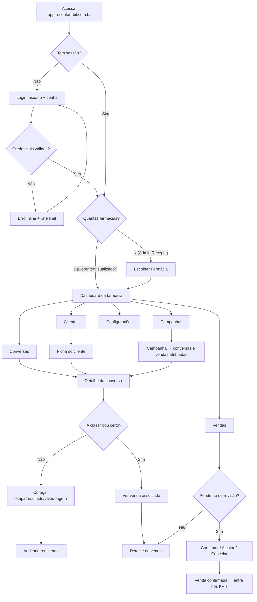
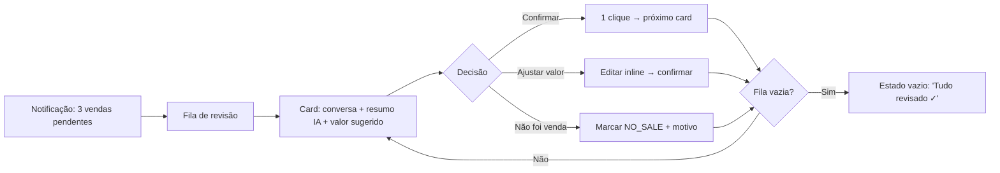
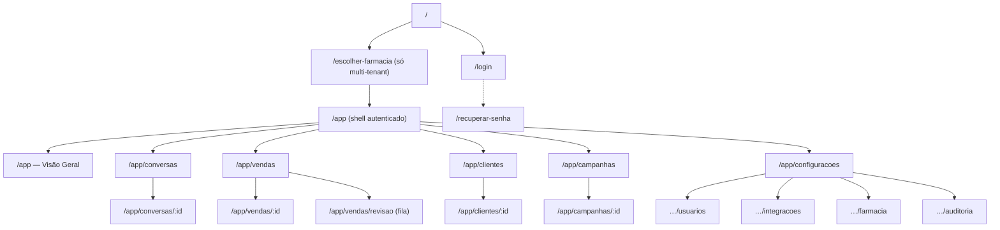
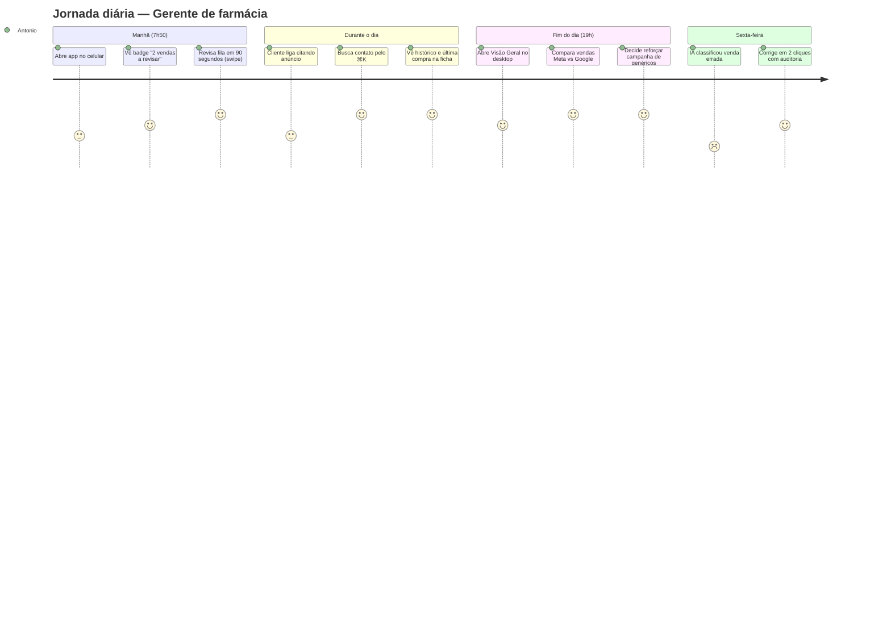
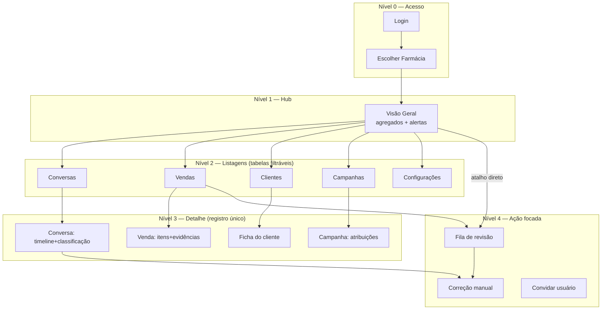

# Recepta Orbit — UX Design Completo

> Product Design baseado na arquitetura (ciclos de conversa 24h, vendas como entidade, atribuição com confiança, RBAC com 3 papéis).
> Referências: Linear (velocidade/teclado), Stripe (tabelas/detalhe), HubSpot (CRM/timeline), Notion (hierarquia), Vercel (onboarding), Metabase (dashboards).

---

## 1. User Flow Completo



**Fluxo crítico do dia a dia (loop de revisão):**



> Padrão Linear: revisão em fila com ações de 1 tecla (C = confirmar, E = editar, X = rejeitar), avanço automático.

---

## 2. Sitemap



**Visibilidade por papel (RBAC):**

| Rota | Admin Recepta | Gerente | Visualizador |
|---|---|---|---|
| Escolher farmácia | ✅ todas | — (vai direto) | — (vai direto) |
| Dashboard / Conversas / Clientes / Campanhas | ✅ | ✅ | ✅ (somente leitura) |
| Vendas — confirmar/corrigir | ✅ | ✅ | ❌ (vê, não edita) |
| Configurações → Usuários / Integrações | ✅ | ✅ usuários da própria farmácia | ❌ |
| Auditoria | ✅ | ✅ | ❌ |

---

## 3. Navegação Desktop

Padrão **Linear/Notion**: sidebar fixa à esquerda, conteúdo fluido, command palette.

```
┌──────────────┬──────────────────────────────────────────────┐
│ ◉ Recepta    │  Breadcrumb · Busca global (⌘K) · Avatar     │
│   Orbit      ├──────────────────────────────────────────────┤
│              │                                              │
│ ▸ Visão Geral│                                              │
│ ▸ Conversas ③│           ÁREA DE CONTEÚDO                   │
│ ▸ Vendas   ②│                                              │
│ ▸ Clientes   │                                              │
│ ▸ Campanhas  │                                              │
│ ──────────   │                                              │
│ ▸ Configurar │                                              │
│              │                                              │
│ [Farmácia ▾] │  ← seletor de tenant (só Admin Recepta)      │
│ [User · Sair]│                                              │
└──────────────┴──────────────────────────────────────────────┘
```

Regras:
- **Badges numéricos** na sidebar = itens que precisam de ação (conversas a revisar, vendas pendentes). Padrão HubSpot.
- **⌘K / Ctrl+K** command palette: ir para tela, buscar contato por nome/telefone, ações rápidas ("confirmar vendas pendentes"). Padrão Linear/Vercel.
- **Seletor de farmácia** no rodapé da sidebar (Admin Recepta) — troca de tenant sem logout. Padrão Vercel (team switcher).
- Sidebar **240px fixa**; colapsável para 64px (só ícones) em telas 1024–1280px.
- Filtros de listagem ficam na **toolbar da página**, nunca na sidebar (padrão Stripe).

---

## 4. Navegação Mobile

Padrão app-like: **bottom tab bar** com 4 destinos + "Mais".

```
┌──────────────────────────────┐
│ ☰  Visão Geral        🔍  ◉ │   ← topbar: menu, título, busca, avatar
│                              │
│         CONTEÚDO             │
│                              │
├──────────────────────────────┤
│  ⌂      💬      🛒      ⋯   │   ← bottom tabs
│ Geral Conversas Vendas  Mais │
└──────────────────────────────┘
```

- **Geral · Conversas · Vendas** = 3 tarefas de maior frequência. **Mais** abre sheet com Clientes, Campanhas, Configurações, trocar farmácia, sair.
- Badge vermelho no tab Vendas quando há pendências de revisão.
- Tabelas viram **cards empilhados** (1 conversa = 1 card com nome, origem, etapa, valor, hora).
- Detalhe de conversa: timeline em tela cheia; painel de classificação vira **bottom sheet** deslizável (padrão HubSpot mobile).
- Fila de revisão: cards com **swipe** — direita confirma, esquerda rejeita; tap abre detalhe.
- Alvos de toque ≥ 44px; ações primárias na zona do polegar.

---

## 5. Wireframes Low Fidelity

### 5.1 Login
```
┌─────────────────────────────┐
│        ◉ Recepta Orbit      │
│                             │
│   Entre na sua farmácia     │
│   Acesso criado pela equipe │
│                             │
│   Usuário    [___________]  │
│   Senha      [_______] 👁   │
│                             │
│   [        Entrar        ]  │
│      Esqueci minha senha    │
└─────────────────────────────┘
```

### 5.2 Escolher Farmácia (Admin Recepta)
```
┌─────────────────────────────────────┐
│  Suas farmácias            [Buscar] │
│  ┌───────────┐ ┌───────────┐        │
│  │ Drogaria  │ │ Farma     │        │
│  │ São Paulo │ │ Vida      │        │
│  │ 12 pend.  │ │ 0 pend.   │        │
│  └───────────┘ └───────────┘        │
└─────────────────────────────────────┘
```

### 5.3 Dashboard (Visão Geral)
```
┌──────────┬──────────────────────────────────────────┐
│ SIDEBAR  │ Visão Geral          [Período: 14d ▾]    │
│          │ ┌──────┐┌──────┐┌──────┐┌──────┐         │
│          │ │Total ││Ticket││Conv. ││Pend. │ ← KPIs  │
│          │ │vendid││médio ││ %    ││revis.│         │
│          │ └──────┘└──────┘└──────┘└──────┘         │
│          │ ┌────────────────┐┌─────────────────┐    │
│          │ │ Conversas/dia  ││ Top produtos    │    │
│          │ │ ▁▃▅▂▇▅█        ││ 1. ▓▓▓▓▓▓ 38    │    │
│          │ └────────────────┘└─────────────────┘    │
│          │ ┌──────────────────────────────────┐     │
│          │ │ Vendas por origem (Meta/Google…) │     │
│          │ └──────────────────────────────────┘     │
│          │ ┌──────────────────────────────────┐     │
│          │ │ ⚠ 2 vendas aguardam revisão  [→] │     │
│          │ └──────────────────────────────────┘     │
└──────────┴──────────────────────────────────────────┘
```

### 5.4 Conversas (listagem)
```
┌──────────┬──────────────────────────────────────────┐
│ SIDEBAR  │ Conversas    [Período▾][Origem▾][Etapa▾] │
│          │              [Status▾][Só revisão ◻]     │
│          │ ┌──────────────────────────────────────┐ │
│          │ │Contato │Origem│Etapa│Valor│Conf│Hora │ │
│          │ │Maria S.│Meta  │Venda│ 89  │91% │14:51│ │
│          │ │João P. │Google│Orçam│ —   │74% │13:22│ │
│          │ │ ⚠ linha destacada quando needsReview │ │
│          │ └──────────────────────────────────────┘ │
│          │              ‹ 1 2 3 ›  50/página        │
└──────────┴──────────────────────────────────────────┘
```

### 5.5 Detalhe da Conversa (padrão Stripe: timeline + painel)
```
┌──────────┬───────────────────────────┬──────────────┐
│ SIDEBAR  │ ← Conversas               │ CLASSIFICAÇÃO│
│          │ Maria Silva · (11)9****   │ Etapa  [Venda│
│          │ ┌───────────────────────┐ │ Status [Encer│
│          │ │ cliente: Boa tarde... │ │ Valor  R$ 89 │
│          │ │      farmácia: Olá! ▶ │ │ IA: 91% ████ │
│          │ │ cliente: Sim, quero 3 │ │──────────────│
│          │ │      farmácia: Pedido▶│ │ ORIGEM       │
│          │ └───────────────────────┘ │ Meta Ads 97% │
│          │ ┌───────────────────────┐ │ Camp: Genéric│
│          │ │ 🤖 Resumo da IA       │ │──────────────│
│          │ │ "Comprou 3cx dipirona"│ │ VENDA s-1041 │
│          │ └───────────────────────┘ │ [Corrigir]   │
└──────────┴───────────────────────────┴──────────────┘
```

### 5.6 Fila de Revisão de Vendas (padrão Linear: triage)
```
┌──────────┬──────────────────────────────────────────┐
│ SIDEBAR  │ Revisão de vendas              2 restantes│
│          │ ┌──────────────────────────────────────┐ │
│          │ │ Carlos Andrade · Google Ads          │ │
│          │ │ "Antibiótico c/ receita, retirada"   │ │
│          │ │ Valor sugerido: R$ 210,00 (conf. 55%)│ │
│          │ │ [resumo + 3 últimas mensagens]       │ │
│          │ │                                      │ │
│          │ │ [✓ Confirmar] [✎ Ajustar] [✗ Não foi]│ │
│          │ │      C            E           X      │ │
│          │ └──────────────────────────────────────┘ │
│          │         ● ○   (progresso da fila)        │
└──────────┴──────────────────────────────────────────┘
```

### 5.7 Ficha do Cliente (padrão HubSpot: perfil + atividades)
```
┌──────────┬──────────────────────────────────────────┐
│ SIDEBAR  │ ← Clientes                               │
│          │ ◉ Rafael Lima · (11) 9****-5543          │
│          │ ┌─────┐┌─────┐┌─────┐┌─────┐             │
│          │ │Total││Tickt││Conv.││Compr│             │
│          │ │ 521 ││ 74  ││ 12  ││  7  │             │
│          │ └─────┘└─────┘└─────┘└─────┘             │
│          │ ┌─────────────────┐┌────────────────┐    │
│          │ │ Conversas       ││ Compras        │    │
│          │ │ (timeline)      ││ (lista+status) │    │
│          │ └─────────────────┘└────────────────┘    │
└──────────┴──────────────────────────────────────────┘
```

### 5.8 Mobile — Conversas + Revisão
```
┌──────────────┐   ┌──────────────┐
│ Conversas  🔍│   │ Revisar  2/3 │
│ ┌──────────┐ │   │ ┌──────────┐ │
│ │Maria S.  │ │   │ │Carlos A. │ │
│ │Meta·Venda│ │   │ │R$ 210,00 │ │
│ │R$89 14:51│ │   │ │conf. 55% │ │
│ └──────────┘ │   │ │ resumo…  │ │
│ ┌──────────┐ │   │ └──────────┘ │
│ │João P.   │ │   │ ←✗ swipe ✓→ │
│ └──────────┘ │   │              │
├──────────────┤   ├──────────────┤
│ ⌂  💬  🛒  ⋯ │   │ ⌂  💬  🛒  ⋯ │
└──────────────┘   └──────────────┘
```

---

## 6. Jornada do Usuário

**Persona principal: Antonio, gerente de farmácia** (45 anos, usa WhatsApp o dia todo, pouco tempo para "sistema").



**Momentos-chave e princípios:**

| Momento | Risco | Solução de design |
|---|---|---|
| Primeiro login | Abandono se vazio | Onboarding com dados chegando ao vivo da Evolution API; estado vazio explica "conecte o WhatsApp" com CTA (padrão Vercel) |
| Revisão diária | Virar tarefa chata | Fila gamificada, < 2 min, atalhos de teclado, swipe no mobile |
| IA erra | Perda de confiança | Confiança sempre visível; correção em 2 cliques; "por que classifiquei assim" com evidências |
| Relatório p/ dono | Dado não confiável | KPIs só contam vendas CONFIRMED; pendentes ficam separadas (padrão Metabase: número auditável) |

---

## 7. Componentes Necessários (Design System)

**Fundações** — tokens já definidos: cores da marca (#D4432C primário, #FFF5D9 fundo, #0A0D0C ink), tipografia (Manrope display / Inter texto), espaçamento 4px, raios, sombras.

| Categoria | Componentes | Referência |
|---|---|---|
| **Navegação** | Sidebar (com badges), Bottom tabs, Breadcrumb, Command palette (⌘K), Tenant switcher, Tabs | Linear, Vercel |
| **Dados** | DataTable (ordenável, paginada, linha clicável, coluna fixa), Card-lista mobile, KPI Card (valor + delta), Progress bar, Sparkline/BarChart, EmptyState, Skeleton loading | Stripe, Metabase |
| **Status** | Badge de etapa (8 estados), Badge de status, Badge de resultado, Badge de origem (8 fontes), ConfidencePill (verde ≥85% / âmbar ≥60% / vermelho <60%), Badge "Revisar" | HubSpot |
| **Conversa** | ChatBubble (in/out), Timeline, AISummaryCard, EvidencePanel (origem + método + confiança), Avatar com iniciais | HubSpot, Stripe |
| **Ações** | Button (primary/secondary/ghost/danger), ReviewCard (confirmar/ajustar/rejeitar), InlineEdit (valor R$), SegmentedControl (período 7d/30d/90d), FilterDropdown, SearchInput, DateRangePicker | Linear |
| **Formulários** | Input, PasswordInput, Select, Checkbox, Toggle, FormField (label+erro), validação inline | Stripe |
| **Feedback** | Toast (sucesso/erro), Modal de confirmação (só p/ destrutivo), Banner de alerta (ex: integração caída), Tooltip, AuditTrail (quem mudou o quê) | Notion |
| **Overlay** | Modal, BottomSheet (mobile), Drawer lateral (detalhe rápido sem sair da lista — padrão Linear peek) | Linear |

Regras transversais:
- Dinheiro sempre em **centavos → formatado BRL**, alinhado à direita em tabelas.
- Toda classificação de IA acompanha **ConfidencePill** — nunca número "seco".
- Ação destrutiva (cancelar venda, desconectar integração) exige confirmação; o resto é otimista com toast + desfazer (padrão Linear).
- Telefones sempre mascarados (`(11) 9****-3421`) para Visualizador; completo para Gerente+ (LGPD).

---

## 8. Hierarquia das Telas



**Princípios de hierarquia:**

1. **Hub → Lista → Detalhe → Ação** — nunca mais de 4 níveis; breadcrumb sempre mostra caminho de volta (padrão Notion).
2. **Dashboard é radar, não destino** — todo número clicável leva à listagem já filtrada (padrão Metabase: drill-down).
3. **Detalhe preserva contexto** — abrir conversa a partir da lista pode usar drawer lateral (peek) antes de navegação completa (padrão Linear).
4. **Ações de revisão têm rota própria** (`/app/vendas/revisao`) — linkável, badge na sidebar, vazia = trabalho em dia.
5. **Cross-links em todo registro**: conversa ↔ venda ↔ cliente ↔ campanha são grafos, não silos (padrão HubSpot: objetos associados).
